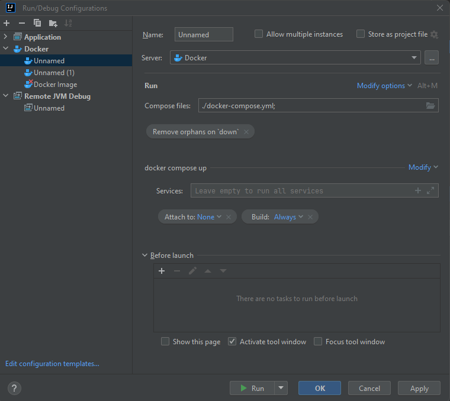
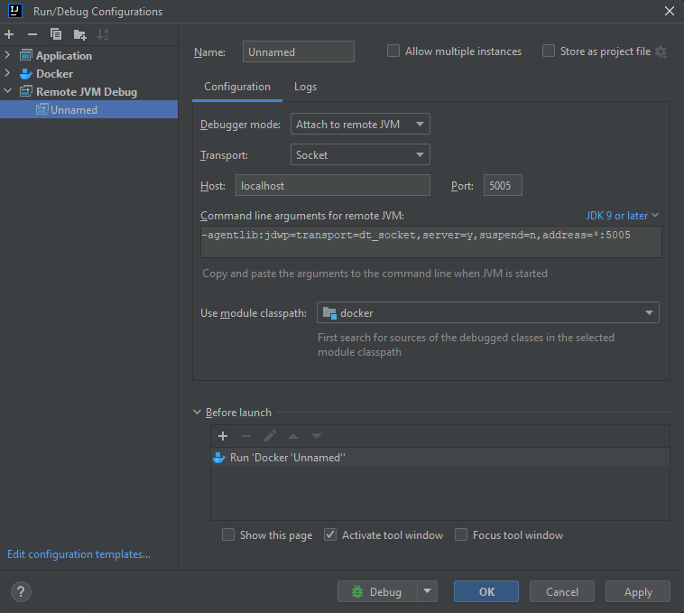

# Tuto sur la configuration de Docker pour IntelliJ

## Prérequis
- Avoir IntelliJ IDEA installé.
- Avoir Docker et Docker Compose installés sur votre machine.
- Un projet Spring Boot existant.

## Étape 1 : Préparer le Projet Spring Boot

1. **Créer un Dockerfile** :
   - Placez le `Dockerfile` dans le répertoire racine de votre projet Spring Boot. Utilisez l'exemple de `Dockerfile` fourni dans les messages précédents.
     ```
     # Étape 1: Base avec Maven et JDK
     FROM maven:3.8.4-openjdk-17-slim AS build
     WORKDIR /app

     # Copie seulement le pom.xml et télécharge les dépendances
     COPY pom.xml .
     RUN mvn dependency:go-offline

     # Copie le reste du code source
     COPY src ./src

     # Construit l'application
     RUN mvn -f pom.xml clean package

     # Étape 2: Image minimale pour exécuter l'application
     FROM openjdk:17-slim
     COPY --from=build /app/target/*.jar app.jar
     ENTRYPOINT ["java","-jar","/app.jar"]

     ```

2. **Créer un fichier docker-compose.yml** :
   - Créez un fichier `docker-compose.yml` dans le répertoire racine de votre projet avec le contenu suivant :
     ```yaml
     version: '3.8'
     services:
       app:
         build: .
         ports:
           - "8080:8080"
           - "5005:5005"
         environment:
           - JAVA_TOOL_OPTIONS=-agentlib:jdwp=transport=dt_socket,server=y,suspend=n,address=*:5005
         volumes:
           - .:/app
           - maven_cache:/root/.m2
     volumes:
       maven_cache:
     ```

## Étape 2 : Configurer IntelliJ IDEA

1. **Ouvrir le Projet dans IntelliJ IDEA** :
   - Ouvrez votre projet Spring Boot dans IntelliJ IDEA.

2. **Configurer une Configuration de Débogage à Distance** :
   - Allez dans `Run > Edit Configurations`.
   - Cliquez sur le `+` pour ajouter une nouvelle configuration.
   - Choisissez `Remote`.
   - Nommez la configuration (par exemple, "Docker Debug").
   - Définissez le `Host` à `localhost` et le `Port` à `5005`.
   - Appliquez et fermez la fenêtre de configuration.

## Étape 3 : Lancer l'Application via Docker Compose dans IntelliJ



1. **Ouvrez la Configuration** :
   - Allez dans `Run > Edit Configurations...` dans IntelliJ IDEA.

2. **Ajouter une Configuration Docker Compose** :
   - Cliquez sur le `+` et choisissez `Docker > Docker-compose`.
   - Donnez un nom à votre configuration, par exemple "Docker Spring Boot".

3. **Configurer le fichier Docker Compose** :
   - Dans la section `Compose files`, indiquez le chemin vers votre fichier `docker-compose.yml`.
   - Si votre projet est dans un sous-dossier, utilisez le chemin relatif ou absolu.

4. **Configurer les Services à Exécuter** :
   - Par défaut, tous les services définis dans le fichier `docker-compose.yml` seront lancés. Si vous souhaitez lancer des services spécifiques, indiquez-les.

5. **Appliquer et Sauvegarder** :
   - Cliquez sur `Apply` puis sur `OK` pour sauvegarder la configuration.


### Configuration du Débogage à Distance dans IntelliJ IDEA



1. **Configurer le Débogage à Distance** :
   - Dans la même fenêtre de configuration, ajoutez une nouvelle configuration en cliquant sur `+` et sélectionnez `Remote JVM Debug`.

2. **Nommer la Configuration de Débogage** :
   - Donnez un nom à votre configuration de débogage, par exemple "Docker Debug".

3. **Paramètres du Débogueur** :
   - Définissez le `Host` à `localhost` et le `Port` au port exposé pour le débogage dans votre `docker-compose.yml` (5005 dans cet exemple).

4. **Configurer les Arguments de Ligne de Commande** :
   - Assurez-vous que les arguments de ligne de commande correspondent à ceux configurés pour la JVM dans votre conteneur Docker.

5. **Avant le Lancement** :
   - Ajoutez une étape avant le lancement pour s'assurer que votre application Docker est en cours d'exécution. Cliquez sur le `+` dans la section `Before launch` et choisissez `Run Docker Compose` et sélectionnez votre configuration Docker Compose créée précédemment.

6. **Appliquer et Sauvegarder** :
   - Cliquez sur `Apply` et ensuite sur `OK` pour sauvegarder votre configuration de débogage.

### Lancer et Déboguer l'Application

1. **Lancer l'Application** :
   - Utilisez la configuration Docker Compose pour lancer votre application. Cela construira votre image si nécessaire et démarrera les conteneurs.

2. **Démarrer la Session de Débogage** :
   - Avec la configuration de débogage à distance en place, démarrez la session de débogage. IntelliJ IDEA se connectera au processus JVM exécuté dans votre conteneur Docker.

3. **Débogage** :
   - Placez des points d'arrêt dans votre code comme d'habitude. IntelliJ IDEA interrompra l'exécution au niveau des points d'arrêt, vous permettant d'inspecter l'état de l'application.
